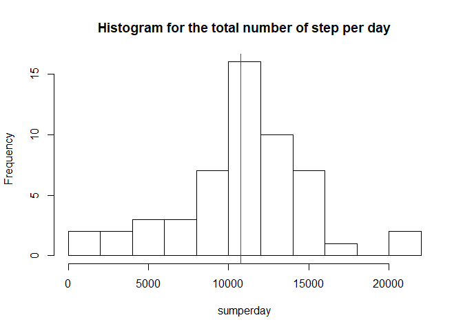
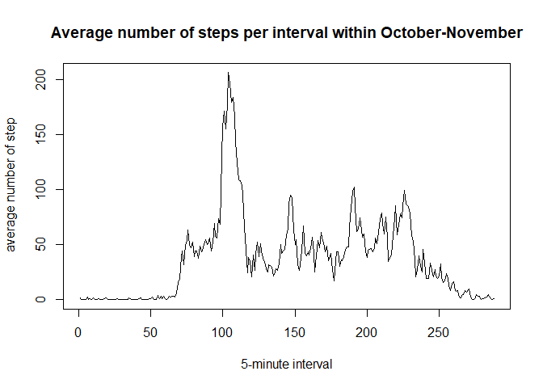
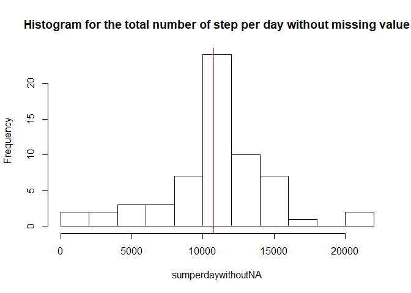
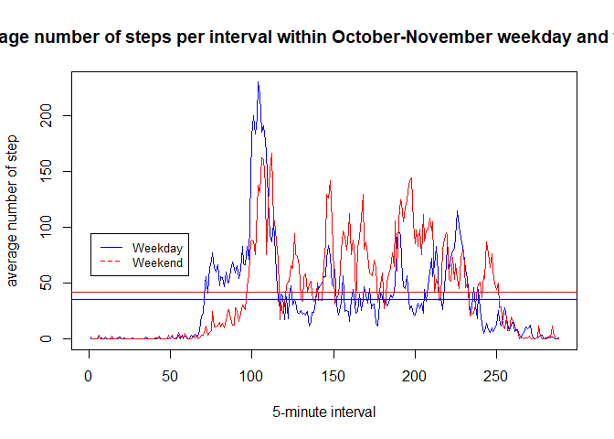

## Loading and preprocessing the data

First we are going to to load all the package we are going to use in this 
assignement:

```r
library(xtable)
library(latexpdf)
library(knitr)
library(lubridate)
```

```
## 
## Attaching package: 'lubridate'
```

```
## The following object is masked from 'package:base':
## 
##     date
```

```r
library(dplyr)
```

```
## 
## Attaching package: 'dplyr'
```

```
## The following objects are masked from 'package:lubridate':
## 
##     intersect, setdiff, union
```

```
## The following objects are masked from 'package:stats':
## 
##     filter, lag
```

```
## The following objects are masked from 'package:base':
## 
##     intersect, setdiff, setequal, union
```


Now we are going set the general option for knit we want to use: 


```r
opts_chunk$set(echo = TRUE,      ###show the code 
               results ="as-is",  ###show the results
               options(scipen=999))###display number within the text in a not scientific format
```

Then we are going to read the corresponding data. We are also processing the
data in the following way, we are changing the class of the "Date" column
to make sure it is in date format and not in character format. 


```r
rawstepdata <- read.csv("activity.csv")

###getting the flavor of the raw data
#head(rawstepdata)
#str(rawstepdata)
#summary(rawstepdata)

tidydata <- rawstepdata
tidydata$date <- as.Date.character(rawstepdata$date,format = '%Y-%m-%d')
str(tidydata)
```

```
## 'data.frame':	17568 obs. of  3 variables:
##  $ steps   : int  NA NA NA NA NA NA NA NA NA NA ...
##  $ date    : Date, format: "2012-10-01" "2012-10-01" ...
##  $ interval: int  0 5 10 15 20 25 30 35 40 45 ...
```


## What is mean total number of steps taken per day?

So we want to compute the mean of the total number of step per day. 
First we need to have a table that sum up the  number of step for each day.


```r
sumperday <- with(tidydata, tapply(steps, FUN = sum, date))  ### We apply on the data set tidy data, the function sum on the number of set by factoring on the date)
```

Now we are going to plot the histogram of the number of step for each day. We also want to plot the mean (in green) and the median (in red).


```r
hist(sumperday,
     breaks = 10,
     main = "Histogram for the total number of step per day") ### we took 10 as a break line to have a better understanding on how is split our result, and see a littlebit the tail effect. 
abline(v = mean(sumperday,na.rm = TRUE), col="green") ###let us remove the NA value for now in order to get a result
abline(v=median(sumperday, na.rm=TRUE), col="red") ###let us remove the NA value for now in order to get a result
```

<!-- -->

We can see only the red line. But that is normal becasue our mean and median are really close to each other. Indeed, we can compute: 


```r
meanday<- as.numeric(mean(sumperday,na.rm = TRUE))  ###let us remove the NA value for now in order to get a result
medianday<-as.numeric(median(sumperday,na.rm = TRUE)) ###let us remove the NA value for now in order to get a result
```
An we can see that the mean is 10766.1886792 step and the median is 10765.

## What is the average daily activity pattern?

Now we want to make a time series plot of the 5-minute interval (x-axis) and the average number of steps taken, averaged across all days (y-axis). In order words, we would like to take the average for each interval on each date. 

So first we compute:


```r
intervalaverage <- with(tidydata, tapply(steps, FUN = mean, interval,na.rm=TRUE))  ### We apply on the data set tidy data, the function mean on the number of step by factoring on the interval
```

We get the following time series: 


```r
plot(intervalaverage, 
     type='l',
     main= "Average number of steps per interval within October-November",
     xlab = "5-minute interval",
     ylab= " average number of step")
```

<!-- -->

Now we see on the picture that the maximum average per interval seems to be between the 500' and the 1000' interval. 
Let us find the interval for this maximum.


```r
intervalaverage[intervalaverage == max(intervalaverage)]
```

```
##      835 
## 206.1698
```

We can conclude that the interval with the average maximum number of step is the 835' one which is around 

```r
seconds_to_period(835*60)
```

```
## [1] "13H 55M 0S"
```


## Imputing missing values

So now we wish to understand the impact of the missing valueS. 

First let us compute the number of missing values for all the date/interval: 


```r
totalNA <- sum(is.na(rawstepdata$steps))
print(totalNA)
```

```
## [1] 2304
```

Now let us remplace the NA values by suitable other values. 
For each interal where we have an NA value we are going to replace it by the corresponding average value for that interval. 


```r
MissingValue <- tidydata[is.na(tidydata$steps),]    #### extracting all the rows where we have missing values
intervalaverageNew <- as.data.frame(intervalaverage,col.names = FALSE) #### preparing the mean value to replace the missing one
intervalaverageNew$interval <- row.names(intervalaverageNew) ##converting the names of the row in a real column

NewValue <- merge(MissingValue,intervalaverageNew, by = "interval", all.x=TRUE) ###we add an extra column with the replacign value

NewValue$steps <- NULL   ###removing previosu steps NA column
names(NewValue)[3] <- "steps"  ###rename the column of our replacing value
NewValue <- NewValue[order(NewValue$date,NewValue$interval),] ### we reorder to have the date and interval lexical order
NewStepData <- tidydata
NewStepData[is.na(NewStepData$steps),1] <- NewValue$steps ### now we replace in our new data set the missing value
```


Now we are going to do as previously to compute the total number of step for each days. 


```r
sumperdaywithoutNA <- with(NewStepData, tapply(steps, FUN = sum, date))  ### We apply on the data set tidy data, the function sum on the number of set by factoring on the date)
```

Now we are going to plot the histogram of the number of step for each day. We also want to plot the mean (in green) and the median (in red).


```r
hist(sumperdaywithoutNA,
     breaks = 10,
     main = "Histogram for the total number of step per day without missing value") ### we took 10 as a break line to have a better understanding on how is split our result, and see a littlebit the tail effect. 
abline(v = mean(sumperdaywithoutNA), col="green") ###let us remove the NA value for now in order to get a result
abline(v=median(sumperdaywithoutNA), col="red") ###let us remove the NA value for now in order to get a result
```

<!-- -->


Now let us compute our mean and median more precisely: 


```r
meandaywithoutNA<- as.numeric(mean(sumperdaywithoutNA))  ### we get a number because no NA anymore
mediandaywithoutNA<-as.numeric(median(sumperdaywithoutNA)) ### we get a number because no NA
```

An we can see that the mean is 10766.1886792 step and the median is 10766.1886792. As we can observe the mean is slightly above what we had previously and coincide with our new median. We can also observe that the frequency is much higher in our new case around the mean that prevously.


## Are there differences in activity patterns between weekdays and weekends?

Now we wich to understand if there is differnece in the activity patterns between weekdays and week-end.

First let us defined a new variable in our set of data without misssing value that will say if the day is a dady of the week or a day of the week end.


```r
WeekFactorStepData <- NewStepData   ###start from our previous data set which is tidy and withou NA value
WeekFactorStepData$nameday <- weekdays(WeekFactorStepData$date) ### let us determine which are weq


##let us put an indicator telling us if it is sunday or saturday aka the week end
WeekFactorStepData$week_ind <- as.numeric((WeekFactorStepData$nameday == "Sunday" | WeekFactorStepData$nameday == "Saturday")) ###bolean to spot the saturday and sunday
WeekFactorStepData$week_ind[WeekFactorStepData$week_ind==0] <- "weekday"  ##changin the 0 and 1 in appropriate terminology
WeekFactorStepData$week_ind[WeekFactorStepData$week_ind==1] <- "weekend"
```

Now that we have our indicator we are going to do the same comptutaion as previously to get the average accross interval. The only difference is that we are also going to split beetweek week-day and week-end.


```r
##Split the data base in two, one for weekday and the other one for weekend using our indicator
WeekFactorStepDataWeek <- WeekFactorStepData[WeekFactorStepData$week_ind =="weekday",]

WeekFactorStepDataWeekend <- WeekFactorStepData[WeekFactorStepData$week_ind =="weekend",]


##now let us compute our vector of mean for each interval and our both data set
intervalaverageweekday <- with(WeekFactorStepDataWeek, tapply(steps, FUN = mean, interval))  ### We apply on the data set tidy data, the function mean on the number of step by factoring on the interval
intervalaverageweekend <- with(WeekFactorStepDataWeekend, tapply(steps, FUN = mean, interval)) 

##Finally let us plot oour time series

plot(intervalaverageweekday,   ##average for the day of the week
     type='l',
     main= "Average number of steps per interval within October-November weekday and weekend",  ##title
     xlab = "5-minute interval",
     ylab= "average number of step",
     col="blue")
lines(intervalaverageweekend,   ##average for the day of the weekend. We want it on the same graphe
      col="red")
legend(1, 95, legend=c("Weekday", "Weekend"),
       col=c("blue", "red"), lty=1:2, cex=0.8)
abline(h=mean(intervalaverageweekday), col="blue")  ###we had horizontal bar to get the overal mean
abline(h=mean(intervalaverageweekend), col="red")
```

<!-- -->

Indeed we can observe a difference in the activity between the day of the week and the day of the week end. It seems that activity is higher in average (horizontal bar on the graph) for the day of weekend than during the day of the week around working hour. 


